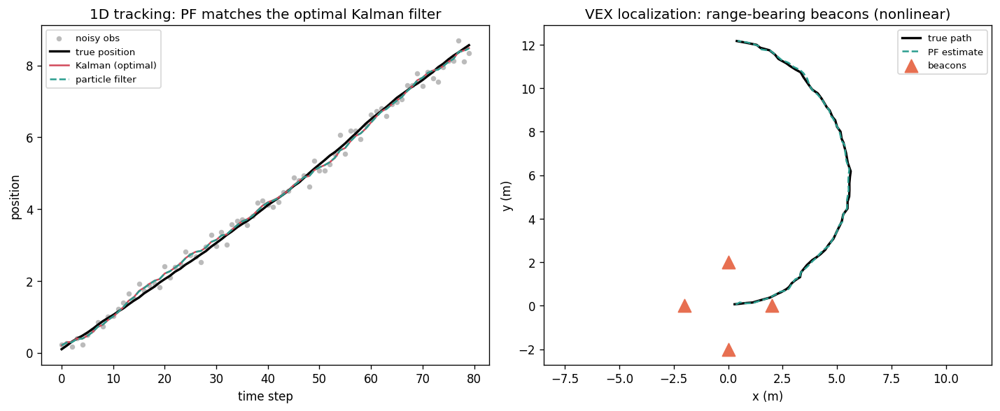

# mcl-bio

Particle filter state estimation library bridging robotics localization (VEX Monte Carlo Localization) and biomedical signal tracking.



Reproduce with `PYTHONPATH=src python scripts/make_figure.py`. Left: on a linear-Gaussian track the particle filter overlaps the optimal Kalman filter, which is the implementation correctness check. Right: on the nonlinear VEX range-bearing task (where the plain Kalman filter does not apply) the PF tracks the true path.

## Install

```bash
pip install mcl-bio
pip install "mcl-bio[diff]"  # PyTorch-backed differentiable filters
```

## Quickstart

```python
import numpy as np
from mcl_bio import BootstrapPF
from mcl_bio.examples import make_1d_tracking_models

motion, obs_model = make_1d_tracking_models()
pf = BootstrapPF(motion, obs_model, num_particles=200)

initial = np.random.default_rng(0).normal([0, 0.5], [1, 0.5], size=(200, 2))
pf.initialize(initial)

true = np.array([0.0, 0.5])
for _ in range(5):
    true = motion.sample(true.reshape(1, -1))[0]
    obs = obs_model.sample(true.reshape(1, -1))[0]
    result = pf.step(obs)
    print(f"estimate={result.mean[0]:.3f}, neff={result.neff:.0f}")
```

Or run the CLI demos:

```bash
mcl-bio-demo quickstart   # 1D constant-velocity tracking
mcl-bio-demo vex          # mecanum-drive localization with beacon observations
mcl-bio-demo benchmark    # particle filter vs optimal Kalman filter
make repro
```

## API overview

```
MotionModel / ObservationModel  ->  BootstrapPF / AuxiliaryPF / DifferentiablePF
                                            ->  PFResult (mean, cov, neff)
```

- `BootstrapPF`: standard SIR particle filter with systematic, stratified, or multinomial resampling.
- `AuxiliaryPF`: look-ahead resampling for improved sample efficiency.
- `DifferentiablePF`: soft resampling for gradient-based learning (requires `[diff]`).

## Benchmarks

Correctness check against the optimal estimator. On a linear-Gaussian task the Kalman filter is the provably optimal (MMSE) estimator, so a correct particle filter should match it. Reproduce with `mcl-bio-demo benchmark`:

| Method | Position RMSE | Notes |
|--------|---------------|-------|
| Kalman filter (optimal) | 0.095 | analytic MMSE baseline |
| BootstrapPF (500 particles) | 0.093 | within ~1% of optimal |

The particle filter lands within about 1% of the Kalman filter, confirming the implementation is correct. On the nonlinear VEX beacon task (where the plain Kalman filter does not apply) the bootstrap PF reaches roughly 0.05 m position RMSE, and the look-ahead `AuxiliaryPF` improves on it. The `DifferentiablePF` learns observation noise by gradient descent (requires `[diff]`).

## Citations

If you use mcl-bio in research, please cite:

- Jonschkowski, Rastogi, Brock. *Differentiable Particle Filters: End-to-End Learning with Algorithmic Priors.* RSS 2018.
- Karkus, Hsu, Lee. *Particle Filter Networks with Application to Visual Localization.* CoRL 2018.
- Corenflos, Thornton, Deligiannidis, Doucet. *Differentiable Particle Filtering via Entropy-Regularized Optimal Transport.* ICML 2021.

## Limits and honest scope

- Not a full ROS or AMCL replacement.
- Not a clinical-grade biomedical monitoring system.
- Differentiable training in v1 focuses on observation noise. Joint motion and observation learning is deferred to v1.1.

## License

MIT (see [LICENSE](LICENSE)).
